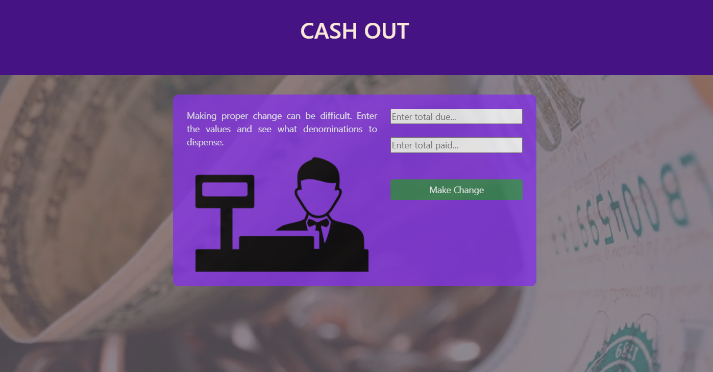
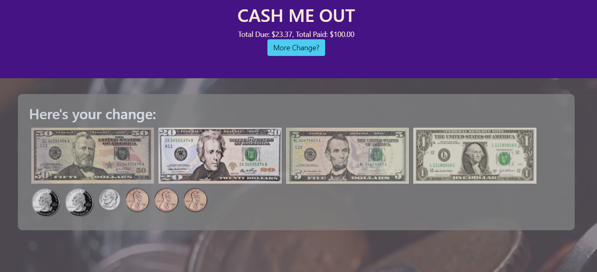

# Cash Me Out
Simple application to determine how much change to return, based on cost and the payment provided.  Utilizes common U.S. currency denominations.

## The Challenge
Giving change can present a chanllenge for young learners inexperienced with money. Create a simple way to practice giving change based on various denominations.

### CHALLENGE ACCEPTED!
https://cash-me-out.herokuapp.com/

### Technology & Tools

    

### Future Plans

- create cash register buttons and actions
- add sound effects
- add drag-and-drop to currency
- make currency notes stackable
- add support for various currencies based on country selected